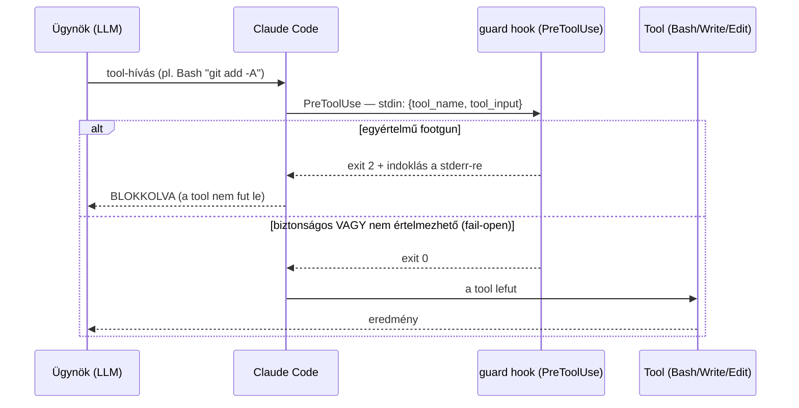

# Agent guard hookok (opt-in PreToolUse védelmek)

## Mi ez?

Három **PreToolUse** hook, amelyek egy megosztott, több-ügynökös munkafában (shared
checkout) a leggyakoribb, dokumentált footgunoktól védenek — még **azelőtt**, hogy az
ügynök Bash/Write hívása lefutna. Mindhárom **fail-open** (hiba esetén enged, sosem
akasztja meg a flottát), és **alapból KI van kapcsolva**: opt-in módon kell bekötni.

| Hook | Melyik toolt őrzi (`matcher`) | Mit blokkol (exit 2) |
|------|-------------------------------|----------------------|
| `git-protect-guard.py` | `Bash` | `git add -A`/`.`/`--all`; force-push egy védett ágra (`main`/`master`/`develop`), ha az explicit meg van nevezve; a contended lockfile (`pnpm-lock.yaml`/`package-lock.json`) stage-elése; destruktív egész-fa műveletek (`git reset --hard`, `git clean -f`, `git checkout .`, csupasz `git stash`) |
| `secret-write-guard.py` | `Write`/`Edit`/`MultiEdit` | Egy fájlba írandó **literál titok** (privát kulcs-blokk, vagy egyértelmű előtagú provider-token: Anthropic/OpenAI/GitHub/Slack/AWS). Csak VALÓDI értékre üt, referenciára (`$(cat ...)`, `process.env.X`, `.env.example` placeholder) nem |
| `big-file-guard.py` | `Write` | Egyetlen `Write`, amelynek tartalma túllépi a `HOOK_MAX_WRITE_BYTES` (alap: 2 MB) korlátot — a „bundle/blob a forrásfába" hibát fogja |

> Miért opt-in? A `git-protect-guard` git-posztúra-döntés: blokkolna olyan parancsokat
> is (`git add -A`, `git reset --hard`), amelyekre egyes munkafolyamatoknak szükségük
> lehet. Ezért nem kötjük be automatikusan — a telepítő tudatosan, felülvizsgálva
> kapcsolja be. (A repo külön, git-szintű `install-git-guard-hook.sh` pre-push hookja
> ettől független: az csak a force-pusht tiltja natív git szinten.)

## Hogyan használd?

A hookok bekötése az ügynök `.claude/settings.json` fájljának `hooks.PreToolUse`
tömbjébe történik — ugyanabban az alakban, ahogy az `egress-gate` és a többi hook. Vedd
fel a kívánt bejegyzéseket (a `{{PROJECT_ROOT}}` a telepítéskor behelyettesítődik, vagy
add meg az abszolút utat):

```jsonc
{
  "hooks": {
    "PreToolUse": [
      {
        "matcher": "Bash",
        "hooks": [
          { "type": "command", "command": "python3 {{PROJECT_ROOT}}/scripts/hooks/git-protect-guard.py", "timeout": 10 }
        ]
      },
      {
        "matcher": "Write|Edit|MultiEdit",
        "hooks": [
          { "type": "command", "command": "python3 {{PROJECT_ROOT}}/scripts/hooks/secret-write-guard.py", "timeout": 10 }
        ]
      },
      {
        "matcher": "Write",
        "hooks": [
          { "type": "command", "command": "python3 {{PROJECT_ROOT}}/scripts/hooks/big-file-guard.py", "timeout": 10 }
        ]
      }
    ]
  }
}
```

Csak azt vedd fel, amelyikre szükséged van — a három egymástól független. A
`big-file-guard` küszöbe környezeti változóval hangolható:

```bash
# Emeld 5 MB-ra (pl. ha nagyobb generált fájlok is legitimek):
export HOOK_MAX_WRITE_BYTES=5000000
```

Önteszt (a git-guard 81 esete):

```bash
python3 scripts/hooks/git-protect-guard.selftest.py
# -> "All 81 cases pass." és exit 0
```

## Hogyan működik?

A Claude Code minden tool-hívás **előtt** meghívja a `matcher`-re illő PreToolUse
hookokat, a tool bemenetét JSON-ként a hook stdin-jére adva. A hook **exit kódja**
dönt: `2` = a hívás blokkolva (a stderr-re írt indoklással), bármi más (`0`) = enged.



- **`git-protect-guard`** kibontja a parancsot (beleértve egy szint `bash -c`/`eval`
  csomagolást is), és csak világos egyezésre üt. „Fail toward allow": egy force-push,
  amely nem nevez meg védett ágat (pl. egy feature-ágra), **átmegy** — a védett ág
  (`main`/`master`/`develop`) explicit megnevezése a blokkolt eset.
- **`secret-write-guard`** a `Write`/`Edit`/`MultiEdit` tartalmát vizsgálja, és csak
  **nagy biztonságú** literál titokra üt (kulcs-blokk vagy félreérthetetlen token-előtag).
  Amit nem tud értelmezni → enged (fail-open).
- **`big-file-guard`** csak a `Write` toolra vonatkozik (ez hordozza a teljes tartalmat);
  az `Edit`/`MultiEdit` deltákat nem méri.

## Technikai részletek

- **Fail-open, mindig.** Minden hiba-ág (nem-parseolható payload, kivétel, hiányzó mező)
  `exit 0` — egy összeomló őr sosem akaszthatja meg a flottát. A védelem szándékosan
  **szűk**: inkább átenged egy határesetet, mint hogy valódi munkát blokkoljon.
- **Nincs perzisztens állapot, nincs titok a fájlokban.** A hookok tisztán a stdin
  payloadból dolgoznak.
- **PreToolUse kontraktus.** A payload `tool_name` és `tool_input` mezőket tartalmaz; a
  hook a `matcher`-hez tartozó toolokra fut. Blokkoláshoz `exit 2` + indoklás a stderr-re.
- **Önteszt.** A `git-protect-guard.selftest.py` 81 BLOCK/ALLOW esetet futtat a guard
  logikáján (útvonal-független fixture-ökkel), és `exit 0`-val zöld.
- **Küszöb.** `big-file-guard`: `HOOK_MAX_WRITE_BYTES` (alap `2_000_000`).
- **Protected ágak.** `git-protect-guard`: `main`, `master`, `develop`.

## Tech stack

- **Python 3** (nincs külső függőség; a repo többi hookjával azonos futtatás:
  `python3 {{PROJECT_ROOT}}/scripts/hooks/<hook>.py`).
- **Claude Code PreToolUse hook** mechanizmus (stdin JSON payload, `exit 2` = block).
- Bekötés az ügynök `.claude/settings.json` `hooks.PreToolUse` tömbjén keresztül
  (ugyanaz az alak, mint az `egress-gate` és a `templates/settings.json.template`
  bejegyzései).
